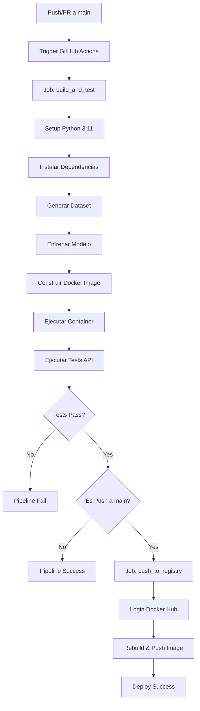

# MLOps Breast Cancer Prediction - GitHub Actions CI/CD Pipeline

## Tabla de Contenidos
- [Descripción General](#descripción-general)
- [Arquitectura del Pipeline](#arquitectura-del-pipeline)
- [Configuración Inicial](#configuración-inicial)
- [Estructura del Workflow](#estructura-del-workflow)
- [Jobs y Etapas Detalladas](#jobs-y-etapas-detalladas)
- [Secretos y Variables](#secretos-y-variables)
- [Triggers del Pipeline](#triggers-del-pipeline)
- [Logs y Debugging](#logs-y-debugging)
- [Mejores Prácticas Implementadas](#mejores-prácticas-implementadas)
- [Troubleshooting](#troubleshooting)

## Descripción General

Este proyecto implementa un pipeline completo de CI/CD (Continuous Integration/Continuous Deployment) usando GitHub Actions para automatizar el ciclo de vida completo de un modelo de Machine Learning para diagnóstico de cáncer de mama. El pipeline garantiza que cada cambio en el código pase por un proceso riguroso de validación antes de ser desplegado.

### Componentes del Sistema
- **Modelo de ML**: Clasificador de cáncer de mama usando Regresión Logística
- **API REST**: Servicio Flask que expone el modelo
- **Containerización**: Docker para empaquetado reproducible
- **CI/CD**: GitHub Actions para automatización completa

## Arquitectura del Pipeline



## Configuración Inicial

### 1. Configurar Secretos en GitHub

Navega a tu repositorio de GitHub y configura los siguientes secretos:

1. Ve a `Settings` > `Secrets and variables` > `Actions`
2. Haz click en `New repository secret`
3. Agrega los siguientes secretos:

#### Secretos Requeridos

| Nombre | Descripción | Ejemplo |
|--------|-------------|---------|
| `DOCKERHUB_USERNAME` | Tu nombre de usuario de Docker Hub | `tu_usuario` |
| `DOCKERHUB_TOKEN` | Token de acceso de Docker Hub | `dckr_pat_...` |

#### Generar Token de Docker Hub

1. Ve a [Docker Hub](https://hub.docker.com)
2. Navega a `Account Settings` > `Security`
3. Click en `New Access Token`
4. Asigna nombre: "GitHub Actions Token"
5. Selecciona permisos: `Read, Write, Delete`
6. Copia el token generado (solo se muestra una vez)

### 2. Estructura de Archivos Requerida

```
.github/
└── workflows/
    └── ci-cd.yml          # Archivo principal del workflow
```

## Estructura del Workflow

### Archivo: `.github/workflows/ci-cd.yml`

```yaml
name: CI/CD Pipeline - Modelo y API

on:
  push:
    branches: [ "main" ]
  pull_request:
    branches: [ "main" ]

env:
  DOCKER_IMAGE_NAME: ${{ secrets.DOCKERHUB_USERNAME }}/mlops-breast-cancer

jobs:
  build_and_test:
    runs-on: ubuntu-latest
    
    steps:
      - name: 1. Clonar el repositorio
        uses: actions/checkout@v4

      - name: 2. Configurar Python
        uses: actions/setup-python@v4
        with:
          python-version: '3.11'
      
      - name: 3. Instalar dependencias
        run: pip install -r requirements.txt
      
      - name: 4. Generar el dataset
        run: python data/load_data.py
        
      - name: 5. Entrenar el modelo
        run: python model/train.py
          
      - name: 6. Construir la imagen Docker
        run: docker build -t $DOCKER_IMAGE_NAME:latest .

      - name: 7. Ejecutar el contenedor para las pruebas
        run: docker run -d --name api-container -p 5000:5000 $DOCKER_IMAGE_NAME:latest

      - name: 8. Ejecutar pruebas de API
        run: python tests/test_api.py

  push_to_registry:
    needs: build_and_test
    if: github.event_name == 'push' && github.ref == 'refs/heads/main'
    runs-on: ubuntu-latest

    steps:
      - name: 1. Clonar el repositorio
        uses: actions/checkout@v4
      
      - name: 2. Iniciar sesión en Docker Hub
        uses: docker/login-action@v3
        with:
          username: ${{ secrets.DOCKERHUB_USERNAME }}
          password: ${{ secrets.DOCKERHUB_TOKEN }}
          
      - name: 3. Entrenar modelo y construir imagen
        run: |
          pip install -r requirements.txt
          python data/load_data.py
          python model/train.py
          docker build -t $DOCKER_IMAGE_NAME:latest .
      
      - name: 4. Empujar la imagen a Docker Hub
        run: docker push $DOCKER_IMAGE_NAME:latest
```

## Jobs y Etapas Detalladas

### Job 1: `build_and_test`

Este job se ejecuta en **todos** los pushes y pull requests a la rama main. Su propósito es validar que el código funciona correctamente.

#### Etapa 1: Clonar Repositorio
```yaml
- name: 1. Clonar el repositorio
  uses: actions/checkout@v4
```
- **Propósito**: Descarga el código fuente del repositorio
- **Action usada**: `actions/checkout@v4` (versión estable)
- **Resultado**: El runner tiene acceso a todos los archivos del proyecto

#### Etapa 2: Configurar Python
```yaml
- name: 2. Configurar Python
  uses: actions/setup-python@v4
  with:
    python-version: '3.11'
```
- **Propósito**: Instala Python 3.11 en el runner
- **Action usada**: `actions/setup-python@v4`
- **Por qué Python 3.11**: Compatibilidad con todas las librerías y rendimiento óptimo
- **Resultado**: Python y pip disponibles en el PATH

#### Etapa 3: Instalar Dependencias
```yaml
- name: 3. Instalar dependencias
  run: pip install -r requirements.txt
```
- **Propósito**: Instala todas las librerías Python necesarias
- **Archivos involucrados**: `requirements.txt`
- **Duración típica**: 30-60 segundos
- **Posibles errores**: Conflictos de versiones, dependencias faltantes

#### Etapa 4: Generar Dataset
```yaml
- name: 4. Generar el dataset
  run: python data/load_data.py
```
- **Propósito**: Crea el archivo `breast-cancer.csv` desde scikit-learn
- **Archivos generados**: `data/breast-cancer.csv`
- **Por qué no usar dataset externo**: Evita dependencias externas y problemas de descarga
- **Duración típica**: 5-10 segundos

#### Etapa 5: Entrenar Modelo
```yaml
- name: 5. Entrenar el modelo
  run: python model/train.py
```
- **Propósito**: Entrena el modelo y genera artefactos
- **Archivos generados**:
  - `model/breast_cancer_model.joblib`
  - `model/scaler.joblib`
  - `model/model_metadata.json`
- **Duración típica**: 10-30 segundos
- **Validaciones**: El script valida datos y reporta métricas

#### Etapa 6: Construir Imagen Docker
```yaml
- name: 6. Construir la imagen Docker
  run: docker build -t $DOCKER_IMAGE_NAME:latest .
```
- **Propósito**: Crea la imagen Docker con la aplicación
- **Archivos involucrados**: `Dockerfile`, código de la API, modelo entrenado
- **Tag usado**: `latest` para identificar la versión más reciente
- **Duración típica**: 60-120 segundos

#### Etapa 7: Ejecutar Container
```yaml
- name: 7. Ejecutar el contenedor para las pruebas
  run: docker run -d --name api-container -p 5000:5000 $DOCKER_IMAGE_NAME:latest
```
- **Propósito**: Levanta el contenedor para realizar pruebas
- **Parámetros importantes**:
  - `-d`: Ejecuta en background (daemon)
  - `--name`: Asigna nombre al contenedor para referencia
  - `-p 5000:5000`: Mapea puerto del host al contenedor
- **Resultado**: API REST corriendo en `http://localhost:5000`

#### Etapa 8: Ejecutar Tests
```yaml
- name: 8. Ejecutar pruebas de API
  run: python tests/test_api.py
```
- **Propósito**: Valida que la API funciona correctamente
- **Tests ejecutados**:
  - Health check (`GET /`)
  - Predicción válida (`POST /predict`)
  - Manejo de datos inválidos
- **Lógica de espera**: El script espera hasta 60 segundos a que la API esté lista
- **Criterio de fallo**: Si cualquier test falla, todo el job falla

### Job 2: `push_to_registry`

Este job **solo se ejecuta** cuando:
1. El job `build_and_test` termina exitosamente
2. El evento es un `push` (no pull request)
3. El push es a la rama `main`

#### Condiciones de Ejecución
```yaml
needs: build_and_test
if: github.event_name == 'push' && github.ref == 'refs/heads/main'
```

#### Etapa 1: Clonar Repositorio
- Idéntica al Job 1

#### Etapa 2: Login a Docker Hub
```yaml
- name: 2. Iniciar sesión en Docker Hub
  uses: docker/login-action@v3
  with:
    username: ${{ secrets.DOCKERHUB_USERNAME }}
    password: ${{ secrets.DOCKERHUB_TOKEN }}
```
- **Propósito**: Autenticar con Docker Hub para poder hacer push
- **Seguridad**: Usa secretos de GitHub, no credenciales hardcodeadas
- **Action usada**: `docker/login-action@v3` - acción oficial de Docker

#### Etapa 3: Reconstruir Imagen
```yaml
- name: 3. Entrenar modelo y construir imagen
  run: |
    pip install -r requirements.txt
    python data/load_data.py
    python model/train.py
    docker build -t $DOCKER_IMAGE_NAME:latest .
```
- **Por qué reconstruir**: Los jobs de GitHub Actions no comparten artefactos por defecto
- **Proceso completo**: Repite el entrenamiento para garantizar consistencia
- **Tiempo adicional**: ~2-3 minutos extra, pero garantiza reproducibilidad

#### Etapa 4: Push a Registry
```yaml
- name: 4. Empujar la imagen a Docker Hub
  run: docker push $DOCKER_IMAGE_NAME:latest
```
- **Propósito**: Publica la imagen validada en Docker Hub
- **Tag**: `latest` indica la versión más reciente
- **Disponibilidad**: La imagen estará disponible públicamente

## Secretos y Variables

### Variables de Entorno

#### A Nivel de Workflow
```yaml
env:
  DOCKER_IMAGE_NAME: ${{ secrets.DOCKERHUB_USERNAME }}/mlops-breast-cancer
```
- **Propósito**: Evita repetir el nombre de la imagen
- **Formato**: `usuario/repositorio`
- **Uso**: Se referencia como `$DOCKER_IMAGE_NAME` en los steps

#### A Nivel de Job/Step
Los jobs pueden definir variables específicas si es necesario.

### Gestión de Secretos

#### Buenas Prácticas Implementadas
1. **Nunca hardcodear credenciales** en el código
2. **Usar secretos de GitHub** para información sensible
3. **Principio de menor privilegio** en tokens
4. **Rotación regular** de tokens de acceso

#### Seguridad
- Los secretos están encriptados en GitHub
- Solo son accesibles durante la ejecución del workflow
- No aparecen en logs (GitHub los enmascara automáticamente)

## Triggers del Pipeline

### Eventos que Activan el Workflow

#### Push a Main
```yaml
on:
  push:
    branches: [ "main" ]
```
- **Cuándo**: Al hacer `git push origin main`
- **Qué ejecuta**: Ambos jobs (`build_and_test` + `push_to_registry`)
- **Propósito**: Deploy automático de cambios validados

#### Pull Requests
```yaml
on:
  pull_request:
    branches: [ "main" ]
```
- **Cuándo**: Al crear/actualizar PR hacia main
- **Qué ejecuta**: Solo `build_and_test`
- **Propósito**: Validación antes de merge

### Flujo Típico de Desarrollo

1. **Desarrollo local**: Desarrollador trabaja en feature branch
2. **Push a feature branch**: No activa el workflow
3. **Crear PR**: Activa `build_and_test` para validación
4. **Review y approve**: Process manual de code review
5. **Merge a main**: Activa workflow completo con deploy

## Logs y Debugging

### Acceder a los Logs

1. Ve a tu repositorio en GitHub
2. Click en la pestaña `Actions`
3. Selecciona el workflow run específico
4. Click en el job que quieres inspeccionar
5. Expande el step específico

### Estructura de Logs

#### Log de Entreamiento
```
🧠 Iniciando entrenamiento del modelo...
📊 Cargando datos...
Dataset cargado desde: /home/runner/work/proyecto/data/breast-cancer.csv
Dataset cargado: 569 filas, 32 columnas
Distribución de clases:
diagnosis
0    357
1    212
📏 Normalizando datos...
🎯 Entrenando modelo de Regresión Logística...
📊 Evaluando modelo...

✅ Precisión del modelo: 0.9649
```

#### Log de Tests
```
🧪 Iniciando tests de la API...
⏳ Esperando que la API esté lista...
✅ API está respondiendo

🔍 Probando endpoint de health check...
Status code: 200
✅ Health Check: PASSED

🔍 Probando predicción con datos válidos...
Status code: 200
✅ Predicción válida: PASSED
```

### Debugging Común

#### Container No Responde
```yaml
- name: Debug - Ver logs del container
  run: docker logs api-container
```

#### Verificar Archivos Generados
```yaml
- name: Debug - Listar archivos del modelo
  run: ls -la model/
```

#### Test de Conectividad
```yaml
- name: Debug - Test manual de API
  run: |
    curl -f http://localhost:5000/ || exit 1
    curl -X POST http://localhost:5000/predict \
      -H "Content-Type: application/json" \
      -d '{"features": [17.99, 10.38, ...]}' || exit 1
```

## Mejores Prácticas Implementadas

### 1. Separación de Concerns
- **Testing separado de Deploy**: Dos jobs independientes
- **Validación antes de publicación**: Solo deploys exitosos
- **Fail fast**: Falla rápido si hay problemas

### 2. Reproducibilidad
- **Versiones fijas** de Python y actions
- **Dataset determinístico** generado desde código
- **Seed fijo** en algoritmos de ML (random_state=42)

### 3. Seguridad
- **Secretos encriptados** para credenciales
- **Tokens con permisos mínimos** necesarios
- **No exposición** de información sensible en logs

### 4. Eficiencia
- **Caché implícito** de capas Docker
- **Paralelización** donde es posible
- **Early termination** en caso de fallos

### 5. Monitoreo
- **Logs estructurados** para debugging
- **Status checks** claros en GitHub
- **Métricas del modelo** reportadas en logs

## Troubleshooting

### Problemas Comunes y Soluciones

#### 1. Error: "docker: command not found"
**Síntoma**: El comando docker no se reconoce
**Causa**: Docker no está instalado en el runner
**Solución**: Los runners de GitHub Actions incluyen Docker por defecto. Verificar la imagen del runner.

#### 2. Error: "No such file or directory: model/*.joblib"
**Síntoma**: La API no encuentra los archivos del modelo
**Causa**: El entrenamiento falló o no se copiaron los archivos al container
**Solución**: 
```yaml
- name: Debug - Verificar archivos
  run: |
    ls -la model/
    docker exec api-container ls -la model/
```

#### 3. Error: "unauthorized: authentication required"
**Síntoma**: No puede hacer push a Docker Hub
**Causa**: Credenciales incorrectas o token expirado
**Solución**: 
- Verificar que los secretos estén configurados correctamente
- Regenerar token en Docker Hub si es necesario

#### 4. Error: "Tests failed - API not responding"
**Síntoma**: Los tests fallan porque no pueden conectar a la API
**Causa**: El container no inició correctamente o toma mucho tiempo
**Solución**:
```yaml
- name: Wait for API
  run: |
    for i in {1..30}; do
      if curl -f http://localhost:5000/; then
        break
      fi
      echo "Waiting for API... ($i/30)"
      sleep 2
    done
```

#### 5. Error: "Python package not found"
**Síntoma**: ImportError durante la ejecución
**Causa**: Dependencia faltante en requirements.txt
**Solución**: Verificar que todas las dependencias estén listadas con versiones específicas

### Estrategias de Debug Avanzado

#### 1. Debug Mode en Workflow
```yaml
- name: Enable debug logging
  run: echo "RUNNER_DEBUG=1" >> $GITHUB_ENV
```

#### 2. SSH Debug (para casos extremos)
```yaml
- name: Setup tmate session
  uses: mxschmitt/action-tmate@v3
  if: failure()
```

#### 3. Artifact Collection
```yaml
- name: Upload logs
  uses: actions/upload-artifact@v3
  if: failure()
  with:
    name: debug-logs
    path: logs/
```

### Optimizaciones Avanzadas

#### 1. Caché de Dependencias
```yaml
- name: Cache pip dependencies
  uses: actions/cache@v3
  with:
    path: ~/.cache/pip
    key: ${{ runner.os }}-pip-${{ hashFiles('**/requirements.txt') }}
```

#### 2. Matrix Testing
```yaml
strategy:
  matrix:
    python-version: [3.9, 3.10, 3.11]
```

#### 3. Conditional Steps
```yaml
- name: Deploy to staging
  if: github.ref == 'refs/heads/develop'
  run: echo "Deploy to staging environment"
```

---

## Conclusión

Este pipeline de CI/CD implementa las mejores prácticas de MLOps moderno, asegurando que cada cambio pase por un proceso riguroso de validación antes del despliegue. La automatización completa reduce errores humanos y garantiza reproducibilidad en todos los entornos.

### Beneficios Clave
- **Automatización completa** del proceso de despliegue
- **Validación rigurosa** antes de cada deploy
- **Reproducibilidad** garantizada en cualquier entorno
- **Trazabilidad** completa de cambios y deployments
- **Seguridad** mediante el uso de secretos encriptados

El pipeline está diseñado para ser mantenible, escalable y fácil de entender, facilitando tanto el desarrollo como la operación del sistema de ML en producción.
